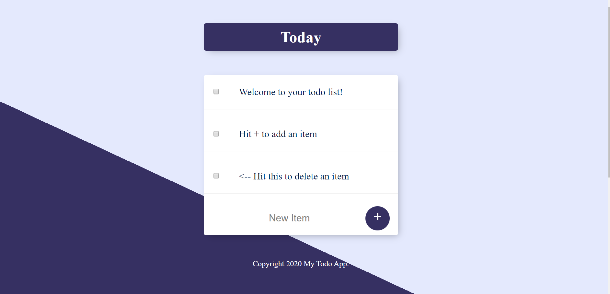
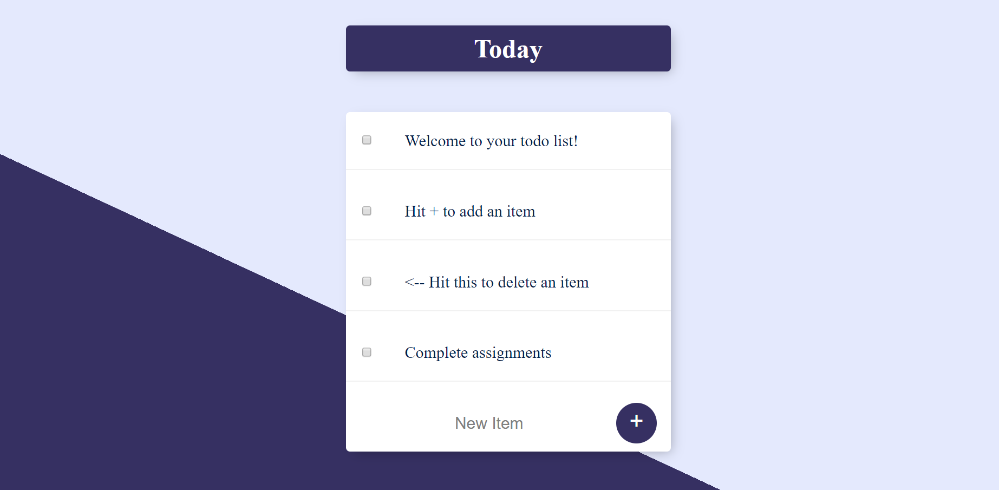
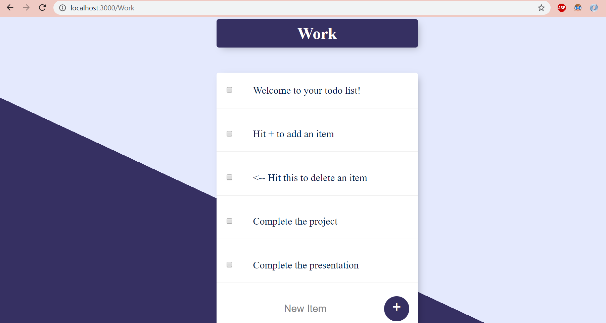

# TodoApp
A Node.js application development.
### Contents
* Overview
* Getting started
* Glimpses
* Technologies used
* Tasks
* Authors
## Overview
A front-end Node.js application where a user can add and delete items from customized to-do lists.The tasks are saved using MongoDB.
Click here to visit the application.
## Getting Started
1) Clone this repository using the command <code>git clone https://github.com/sejal132/TodoApp.git</code>
2) Run command <code>npm install</code> to install all dependencies.
3) Run command <code>npm start</code> to start the application in the development mode.
## Glimpses
Once you run the application, the Today list appears. This is a general list.

We can add items to the list by clicking the + button.

To delete the items, check the checkbox on the left.

Custom lists can be created by adding the title of your list as a route to the base URL. We can add and delete the items from this list too. If you revisit the URL again, the custom list along with all the added items remains saved.

## Technologies used
1) **Node.js**: To make the frontend web application.
2) **Express** :To provide a robust framework for the web server.
3) **MongoDB** :To store and retrieve user data.
4) **Mongoose**:To enable easy Object Data Mapping.
5) **EJS** :To create HTML markup templates using Javascript.
6) **CSS** :To add styling to the HTML templates.

## Tasks
- [x] Create Node.js frontend application
- [x] Add routes to enable a multi pages application
- [x] Create the todoappDB database using MongoDB and Mongoose and connect it to the server.
- [ ] User Authentication
- [x] Fixing Few bugs
- [x] Testing
- [ ] Deployment using MongoDB Atlas

## Authors
[Sejal Agrawal](https://github.com/sejal132)

